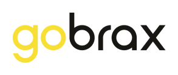

<h1 align="center">
   <a href="https://gobrax.com.br/" target="_blank">
      
   </a>
</h1>

# Gobrax Challenge 👋

Projeto desenvolvido com [Expo](https://expo.dev) para o desafio mobile Gobrax.

## 🚀 Sobre o projeto

O objetivo desse projeto é gerenciar o cadastro de motoristas e veículos. Com ele é possível visualizar os cadastros já existentes, bem como adicionar, editar e remover cadastros. Também é possível adicionar ou remover o vínculo de um motorista com um veículo.

## 📋 Como usar

1. Instale as dependências

   ```bash
   npm install
   ```

2. Inicie o JSON server

   ```bash
   npx json-server db.json
   ```

3. Crie o arquivo .env na raiz do projeto com a URL gerada pelo JSON server

   ```bash
   EXPO_PUBLIC_API_URL="http://localhost:3000"
   ```

4. Inicie o projeto

   ```bash
    npx expo start
   ```
